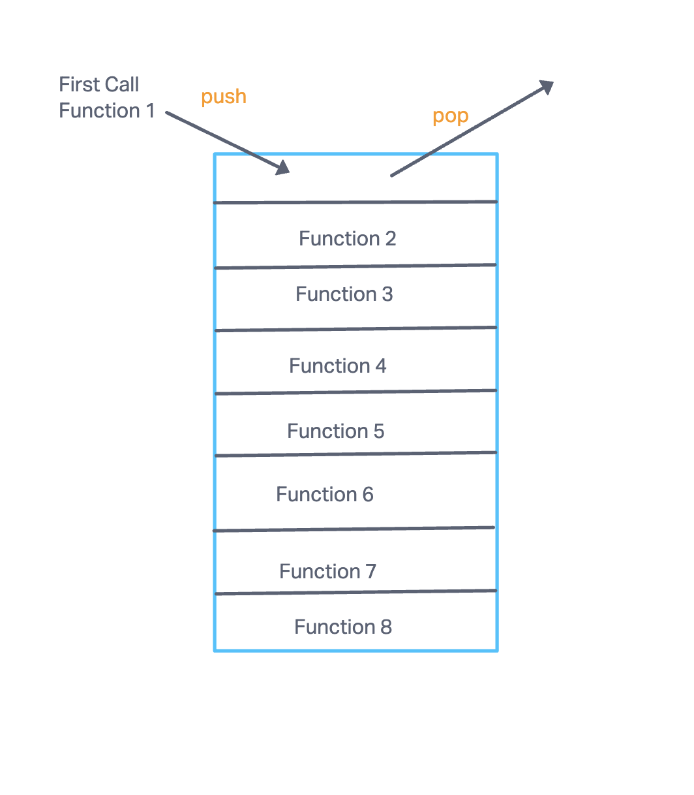

# Read: Class 10

## Understanding the JavaScript Call Stack  

1. What is a ‘call’?  
  *A call is function invocation, which a call stack is primarily used for.*  

2. How many ‘calls’ can happen at once?  
  *Only one call can happen one at a time.*  

3. What does LIFO mean?  
  *LIFO stands for Last In First Out. It means that the last function that gets pushed into the stack is the first to pop out when the function returns.  

4. Draw an example of a call stack and the functions that would need to be invoked to generate that call stack.  
  

5. What causes a Stack Overflow?  
  *A Stack Overflow is caused when there's a recursive function without an exit point. This means that there is a function that invokes itself.*  

## JavaScript error messages  

1. What is a ‘reference error’?  
  *A reference error is when you try to use a variable that is not yet declared.*  

2. What is a ‘syntax error’?  
  *A syntax error is when you have something that cannot be parsed in terms of syntax.*  

3. What is a ‘range error’?  
  *A range error is when you try to manipulate an object with a set length and that gives it an invalid length.*  

4. What is a ‘type error’?  
  *A type error is when you try to access an incompatible type such as a number or string which has not been defined yet.*  

5. What is a breakpoint?  
  *A breakpoint is the line in your code that is causing an error or bug.*  

6. What does the word ‘debugger’ do in your code?  
  *It stops the code from running and calls upon the debug function if there is one.*  
